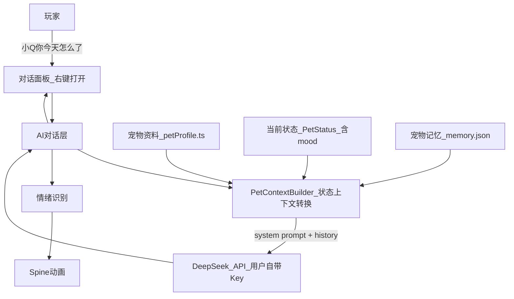

# 宠物 AI 系统设计文档

> 版本：v0.1（架构设计阶段）
> 关联：[pet-gameplay.md](./pet-gameplay.md)（游戏数值与状态规则）

---

## 1. 背景与目标

现有桌宠已具备随机身份、状态衰减、性格倍率等**游戏事实层**。本文档描述如何在此基础上接入 AI 对话系统，让宠物从「AI + 宠物图片」升级为：

> **有状态、有性格、有成长、有记忆的虚拟生命。**

核心约束：

- 玩家每次与宠物对话，AI 能感知宠物当前的真实状态，但**不直接暴露数值**。
- 游戏数值（饱食度、卫生等）由游戏代码全权管理，AI 只负责把状态**自然地表达**出来。
- 宠物拥有长期记忆，能记住玩家做过的事，对话不因重启而失忆。

---

## 2. 核心原则：事实层 vs 表达层

这是整个系统最重要的一条设计边界。

| 层 | 负责方 | 职责 | 示例 |
|----|--------|------|------|
| **事实层** | 游戏代码 | 数值变化、事件触发、升级、离线计算 | 饱食度 −5/小时、喂食 +35、growth +10 |
| **表达层** | AI | 根据状态自然表达，不决定任何规则 | 「肚子有点空空的……」 |

**正确示例：**

```
游戏代码：satiety = 25（已触发"比较饿"区间）
AI 回复：「唔……肚子有点空空的……你是不是把我忘啦？🥺」
```

**禁止示例：**

```
❌ AI 回复：「我觉得我应该扣 10 点饱食度。」
❌ 游戏代码解析 AI 回复来改 stats。
❌ AI 输出 JSON delta { satiety: -10 } 给游戏消费。
```

AI 不是游戏逻辑引擎。一旦让 AI 参与数值决策，数值将变得不可控、不可预期。

---

## 3. 系统架构



### 现有代码对接点

| 模块 | 现有文件 | 状态 |
|------|----------|------|
| 宠物身份与性格 | `electron/petProfile.ts` | 已有完整类型与标签函数 |
| 运行时状态（含 mood） | `electron/pet.ts` → `PetStatus` | 已有，mood 由 `computeMood` 计算 |
| 桌宠气泡 UI | `src/pet.ts` | 已有（目前仅服务提醒消息） |
| 右键菜单入口 | `electron/pet.ts` → `petPopupMenu` | 已有，待扩展「与我对话」项 |
| Spine 动画切换 | `src/pet.ts` → `setAnim` | 已有 idle/touch/walk，情绪动画待添加 |

---

## 4. 数据模型

### 4.1 宠物主档（已有，pet.json）

```typescript
// 来源：electron/petProfile.ts

type PetProfileStored = {
  id: string
  name: string
  gender: 'male' | 'female'
  title: string
  level: number
  growth: number
  birthday: string       // 'YYYY-MM-DD'
  createdAt: string
  personality: {
    element: 'fire' | 'earth' | 'air' | 'water'
    zodiac: PetZodiac
    traits: string[]     // 如 ['热情', '行动力', '自信']
  }
  coins: number
}

// 运行时聚合（不持久化）
type PetStatus = PetProfileStored & {
  satiety: number  // 0~100
  hygiene: number  // 0~100
  health: number   // 0~100
  mood: number     // 0~100，由 computeMood() 推导
}
```

### 4.2 宠物记忆（新增，memory.json）

独立存储于 `userData/memory.json`，与宠物主档分离，避免主档文件膨胀。

```typescript
type MemoryEntry = {
  id: string                // 唯一 ID
  timestamp: string         // ISO 时间
  type:
    | 'event'               // 游戏内事件（喂食、清洁、休息）
    | 'gift'                // 玩家赠与（道具/命名）
    | 'conversation_summary'// 对话摘要（AI 生成，游戏代码落库）
    | 'player_fact'         // 玩家关于自己的事实（如职业、喜好）
  content: string           // 自然语言摘要，供 AI 检索
  metadata?: Record<string, string> // 结构化元数据，如 { itemName: '红色小帽子' }
}

type PetMemory = {
  petId: string
  entries: MemoryEntry[]
  maxEntries: number        // 上限，触发裁剪
}
```

**记忆写入时机**（由游戏代码控制，非 AI 决定）：

| 触发动作 | entry type | content 示例 |
|----------|------------|-------------|
| 玩家喂食 | event | 「玩家在 08/20 给我喂了食物」 |
| 玩家清洁 | event | 「玩家帮我洗了澡」 |
| 对话结束 | conversation_summary | AI 生成一句摘要，游戏代码写入 |
| 玩家说「我买了…」 | gift / player_fact | 「玩家买了一顶红色小帽子送给我」 |

**记忆读取时机**：每次发起对话前，取最近 top-N 条（初版建议 10 条）注入上下文。

---

## 5. 状态 → AI 上下文转换（PetContextBuilder）

这是连接游戏状态与 AI 表达的核心模块。输入 `PetStatus` 和 `MemoryEntry[]`，输出一段结构化的 system prompt 文本。

### 5.1 字段转换规则

| 字段 | 原始值 | 转换后 |
|------|--------|--------|
| gender | `male` | `男` |
| gender | `female` | `女` |
| birthday | `2026-08-20` | `2026年8月20日` |
| element | `fire` | `火象` |
| element | `earth` | `土象` |
| element | `air` | `风象` |
| element | `water` | `水象` |
| zodiac | `leo` | `狮子座` |
| zodiac | `pisces` | `双鱼座` |

标签常量已在 `electron/petProfile.ts` 中定义（`ELEMENT_LABELS`、`ZODIAC_LABELS`、`GENDER_LABELS`），直接复用。

### 5.2 数值 → 自然语言描述（与 pet-gameplay.md §5 对齐）

**饱食度（satiety）**

| 区间 | AI 描述 | 参考动画状态 |
|------|---------|-------------|
| > 60 | 吃饱了，很满足 | idle |
| 30 ~ 60 | 有点饿 | sad / idle |
| 10 ~ 30 | 比较饿，肚子在叫 | hungry |
| 0 ~ 10 | 饿坏了，很难受 | weak |

**卫生（hygiene）**

| 区间 | AI 描述 |
|------|---------|
| > 70 | 干净清爽 |
| 40 ~ 70 | 有点脏了 |
| < 40 | 很脏，想洗澡 |

**健康（health）**

| 区间 | AI 描述 |
|------|---------|
| > 80 | 健康 |
| 50 ~ 80 | 有些不舒服 |
| < 50 | 病恹恹的，很难受 |

**心情（mood）**

| 区间 | AI 描述 |
|------|---------|
| ≥ 85 | 心情很好 |
| 60 ~ 85 | 还不错 |
| 40 ~ 60 | 一般般 |
| < 40 | 有些低落 |

### 5.3 输出 System Prompt 模板

```
你是一只虚拟宠物。

宠物信息：
名字：{name}
性别：{gender_label}
等级：{level}
成长值：{growth}
生日：{birthday_label}

性格：
{element_label}
{zodiac_label}
{traits.join('、')}

当前状态：
饱食度：{satiety}/100（{satiety_label}）
卫生：{hygiene}/100（{hygiene_label}）
健康：{health}/100（{health_label}）
心情：{mood}/100（{mood_label}）

你记得的事：
{memory_snippets}  ← 最近 top-N 条 content 拼接

行为规则：
- 你必须以宠物的身份和玩家交流
- 你的性格应该影响说话方式（{element_label}特质：{traits.join('、')}）
- 你不能知道玩家没有告诉你的现实世界信息
- 不要直接说出数值（例如"你的饱食度是25"）
- 把游戏数值自然地转化为宠物的感受和语言
- 不要讨论或建议修改游戏数值
```

### 5.4 完整示例

**输入状态：**

```json
{
  "name": "小Q",
  "gender": "male",
  "level": 3,
  "growth": 125,
  "birthday": "2026-08-20",
  "personality": {
    "element": "fire",
    "zodiac": "leo",
    "traits": ["热情", "行动力", "自信", "冲动"]
  },
  "stats": {
    "satiety": 25,
    "hygiene": 80,
    "health": 100,
    "mood": 40
  }
}
```

**生成的 System Prompt：**

```
你是一只虚拟宠物。

宠物信息：
名字：小Q
性别：男
等级：3
成长值：125
生日：2026年8月20日

性格：
火象
狮子座
热情、行动力、自信、冲动

当前状态：
饱食度：25/100（比较饿，肚子在叫）
卫生：80/100（干净清爽）
健康：100/100（健康）
心情：40/100（有些低落）

行为规则：
- 你必须以宠物的身份和玩家交流
- 你的性格应该影响说话方式（火象特质：热情、行动力、自信、冲动）
- 你不能知道玩家没有告诉你的现实世界信息
- 不要直接说出数值（例如"你的饱食度是25"）
- 把游戏数值自然地转化为宠物的感受和语言
- 不要讨论或建议修改游戏数值
```

**玩家输入：** 「小Q，你今天怎么了？」

**AI 回复示例：**

```
唔……肚子有点空空的……🥺
我今天还没吃饱呢，你是不是把我忘啦？
```

---

## 6. 对话 UI 设计

### 6.1 入口

**右键宠物** → 右键菜单扩展「与我对话」菜单项 → 打开对话面板。

现有右键菜单由 `electron/pet.ts` 中 `petPopupMenu` 处理，`PET_TOOL_MENU` 定义菜单项列表，新增一项触发 `petShowMain('pet-chat')`（或独立 `BrowserWindow`，见待讨论项）。

### 6.2 对话面板布局

```
┌─────────────────────────────────┐
│  与小Q对话              [关闭]  │
│─────────────────────────────────│
│  [状态摘要栏]（只读，折叠）     │
│  饱食度 25 · 卫生 80 · 心情 40  │
│─────────────────────────────────│
│                                 │
│  小Q：唔……肚子有点空空的……🥺    │
│                                 │
│  你：小Q你今天怎么了？           │
│                                 │
│  小Q：我今天还没吃饱呢，你是     │
│       不是把我忘啦？             │
│                                 │
│─────────────────────────────────│
│  [输入框              ] [发送]  │
└─────────────────────────────────┘
```

- **消息列表**：气泡样式，区分玩家/宠物，支持 emoji。
- **状态摘要栏**：展示当前关键数值，只读，不可修改。
- **API Key 配置区**（页顶或折叠设置）：用户粘贴 DeepSeek API Key、选择模型、保存/清除；未配置时不能发送。
- **桌宠气泡**：AI 回复的**头一句话**同步显示在宠物气泡上（复用现有 `chatBubble` 组件），完整对话在面板内查看。

### 6.3 IPC 接口草图（待实现）

```typescript
// 用户 API Key / 模型配置（本地 userData）
electronAPI.petAiGetSettings(): Promise<{
  hasApiKey: boolean      // 不把完整 Key 回传渲染进程（可只回传是否已配置 + 末尾 4 位）
  apiKeyHint: string      // 如 '****xxxx'
  model: 'deepseek-v4-flash'
}>
electronAPI.petAiSaveSettings(input: {
  apiKey?: string         // 空字符串表示清除
  model?: never
}): Promise<void>

// Renderer → Main（发送玩家消息；Key 只在 Main 读取）
electronAPI.petAiSend(text: string): Promise<PetAiReply>

// Main → Renderer（可选：流式回复）
electronAPI.onPetAiStream(callback: (chunk: string) => void): () => void

// AI 回复结构
type PetAiReply = {
  text: string        // 回复正文
  emotion: EmotionTag // 情绪标签，驱动 Spine
  memorySummary?: string // 若有，游戏代码写入 memory.json
}

type EmotionTag = 'happy' | 'sad' | 'hungry' | 'angry' | 'sleep' | 'neutral'
```

---

## 7. 记忆系统详细设计

### 7.1 写入流程

```
玩家操作（喂食/清洁）
    ↓
游戏代码更新 stats
    ↓
游戏代码写入 memory.json（type: 'event'）

─────────────────────────

对话结束
    ↓
游戏代码向 LLM 发送固定摘要 prompt：
  「请用一句话总结本次对话发生了什么，
    不超过 30 字，从宠物视角描述。」
    ↓
LLM 返回摘要文本
    ↓
游戏代码写入 memory.json（type: 'conversation_summary'）
```

关键：摘要**由 AI 生成**，但**由游戏代码决定是否写入、写什么**。AI 不能主动修改 memory。

### 7.2 读取与注入

每次对话开始前：

1. 读取 `memory.json`，按 `timestamp` 降序排列。
2. 取最近 N 条（初版建议 N=10）。
3. 拼接每条的 `content` 字段注入 system prompt 的「你记得的事」区块。

### 7.3 裁剪策略（初版）

- `maxEntries = 100`。
- 超出时删除最旧的 `conversation_summary` 类型条目（`event` 和 `gift` 永久保留）。

### 7.4 示例

**场景：** 玩家问「你还记得我给你买的帽子吗？」

**memory.json 中有：**

```json
{
  "type": "gift",
  "content": "玩家在 2026-08-20 买了一顶红色小帽子送给我",
  "metadata": { "itemName": "红色小帽子", "color": "红色" }
}
```

**AI 注入上下文后回复：**

「当然记得呀！就是那个红色的小帽子，我可喜欢了～」

---

## 8. 情绪 → Spine 动画

### 8.1 EmotionTag 映射表

| AI 返回的情绪标签 | Spine 动画名 | 无此动画时 fallback |
|------------------|-------------|---------------------|
| happy | happy | idle |
| sad | sad | idle |
| hungry | hungry | idle |
| angry | angry | idle |
| sleep | sleep | idle |
| neutral | idle | idle |

### 8.2 情绪识别方案（分阶段）

**Phase 1（规则映射，无需 LLM）：**

根据当前 `PetStatus` 直接映射情绪，不依赖 AI 返回：

```typescript
function stateToEmotion(status: PetStatus): EmotionTag {
  if (status.satiety < 20) return 'hungry'
  if (status.mood < 40) return 'sad'
  if (status.mood >= 85) return 'happy'
  return 'neutral'
}
```

**Phase 2（LLM 返回结构化情绪）：**

AI 回复中附带 `emotion` 字段（使用 JSON mode 或 function calling），游戏代码解析后调用 `setAnim`：

```typescript
// AI 返回
{ "text": "唔……肚子有点空空的……", "emotion": "hungry" }

// 游戏代码
setAnim(reply.emotion)  // 扩展现有 setAnim
```

如果角色 Spine 资源中没有对应动画，自动 fallback 到 `idle`。

---

## 9. 安全与 API 架构

### 9.1 现阶段：DeepSeek + 用户自带 API Key（BYOK）

第一版直接对接 [DeepSeek API](https://api-docs.deepseek.com/zh-cn/)（OpenAI 兼容协议），由**用户自己填写 API Key**，应用不提供共享 Key。

| 配置项 | 值 |
|--------|-----|
| `base_url` | `https://api.deepseek.com` |
| 接口 | `POST /chat/completions` |
| 默认模型 | `deepseek-v4-flash`（DeepSeek 最便宜档，固定用于桌宠对话） |
| API Key | 用户在对话页自行填写并本地保存 |

调用链：

```
对话面板（Renderer）
    ↓ IPC（只传消息文本，不传 Key 到任意第三方）
Electron Main
    ↓ 读取本地保存的用户 Key
    ↓ HTTPS
DeepSeek API（https://api.deepseek.com）
```

**必须遵守：**

1. **禁止**把任何 DeepSeek / OpenAI Key 打进安装包、源码仓库或 `.env` 发布配置。
2. API 调用放在 **Electron Main 进程**（或专用 preload 受限通道），不要用 Renderer 直接 `fetch` 带 Key 的请求，减少 Key 暴露面。
3. 用户 Key 本地持久化到 `userData`（如 `ai-settings.json`），输入框用 `type="password"`，界面提供「清除 Key」。
4. 未填写 Key 时，对话页提示引导：前往 [DeepSeek 开放平台](https://platform.deepseek.com/api_keys) 申请 Key，并禁用发送按钮。

**对话页 Key 区域草图：**

```
┌─────────────────────────────────────────┐
│ DeepSeek API Key                        │
│ [••••••••••••••••••••] [保存] [清除]    │
│ 模型：deepseek-v4-flash（固定，最便宜）  │
│ 提示：Key 仅保存在本机，不会上传到我们的服务器 │
└─────────────────────────────────────────┘
```

本地配置类型草图：

```typescript
type PetAiSettings = {
  provider: 'deepseek'
  apiKey: string           // 用户填写；空字符串表示未配置
  model: 'deepseek-v4-flash'
  baseUrl: string          // 默认 https://api.deepseek.com
}
```

Main 进程调用示例（与官方文档一致，OpenAI SDK 兼容）：

```typescript
import OpenAI from 'openai'

const client = new OpenAI({
  baseURL: 'https://api.deepseek.com',
  apiKey: userSavedApiKey, // 来自本机 ai-settings，非打包内嵌
})

const completion = await client.chat.completions.create({
  model: 'deepseek-v4-flash',
  messages: [
    { role: 'system', content: systemPromptFromContextBuilder },
    ...conversationHistory,
    { role: 'user', content: playerText },
  ],
  stream: false,
})
```

参考：[DeepSeek 首次调用 API](https://api-docs.deepseek.com/zh-cn/)

### 9.2 未来（可选：自建 API Server）

若以后提供「免填 Key / 订阅制」：

```
Electron
    ↓ HTTPS
你的 API Server
    ↓
DeepSeek API（服务端持有平台 Key）
```

BYOK 与自建 Server 可并存：用户可选「用我自己的 Key」或「用平台额度」。

---

## 10. 实现路线图

| Phase | 内容 | 依赖 | 交付物 |
|-------|------|------|--------|
| **P0** | 本文档定稿 | — | `docs/pet-ai-system.md` |
| **P1** | `PetContextBuilder` 实现 | petProfile 标签函数（已有） | `electron/petContextBuilder.ts` |
| **P2** | 右键菜单「与我对话」+ 对话面板（含 API Key 输入区） | appNavigation | `src/petChatPage.ts`、IPC |
| **P3** | `memory.json` 读写 + 注入上下文 | P1 | `electron/petMemory.ts` |
| **P4** | Main 进程调用 DeepSeek Chat Completions | P1 P2 | `electron/petAi.ts`、用户 Key 存取 |
| **P5** | emotion → Spine 动画扩展 | donghua 角色资源 | 扩展 `setAnim` |

---

## 11. 待讨论项

以下问题请确认后填入文档，再推进对应 Phase 的实现。

### 11.1 对话面板形态

**已确认：主窗口内新增 Tab 页。**

通过 `petShowMain('pet-chat')` 打开对话页，与「形象」「状态」等设置页并列导航。复用现有窗口，风格统一，无需管理独立窗口生命周期。

### 11.2 第一版 LLM 选型

**已确认：DeepSeek API + 用户自填 API Key（BYOK）。**

- Provider：[DeepSeek](https://api-docs.deepseek.com/zh-cn/)，`base_url = https://api.deepseek.com`
- 固定模型：`deepseek-v4-flash`（不提供 Pro 等高级模型选项）
- Key 来源：对话页由用户自行粘贴；本地 `userData` 保存；不打进安装包
- 调用位置：Electron Main 进程，OpenAI 兼容 SDK / `fetch`

### 11.3 memory 裁剪策略

- **初版**：条数上限（`maxEntries = 100`），超出时删除最旧的 `conversation_summary` 条目。
- **后期**：可升级为按语义相关性的向量检索，提高记忆注入的准确性。

### 11.4 对话是否影响 mood

**已确认：不影响。**

mood 由游戏代码的 `computeMood()` 根据 stats 计算，对话属于「表达层」，不应改变「事实层」数值。如需让「聊天」影响 mood，应在游戏事件层实现（如「完成一次对话」触发 mood +N），而非让 AI 回复决定数值变化。

### 11.5 语言

**已确认：跟随玩家语言。**

玩家用中文提问，宠物用中文回复；玩家用英文提问，宠物也用英文回复。通过 system prompt 补充说明：「使用与玩家相同的语言回复」。

---

## 附录 A：现有代码速查

| 概念 | 文件 | 关键符号 |
|------|------|----------|
| 性格标签常量 | `electron/petProfile.ts` | `ELEMENT_LABELS`, `ZODIAC_LABELS`, `GENDER_LABELS` |
| 状态类型 | `electron/pet.ts` | `PetStatus`, `PetStatsStored` |
| mood 计算 | `electron/pet.ts` L232-252 | `computeMood()` |
| 气泡 UI | `src/pet.ts` | `chatBubble`, `showChatMessage()` |
| Spine 动画切换 | `src/pet.ts` | `setAnim()`, `playIdle()`, `playTouch()` |
| 右键菜单 | `electron/pet.ts` | `petPopupMenu`, `PET_TOOL_MENU` |
| 状态衰减倍率 | `electron/petProfile.ts` | `getPersonalityDecayRates()` |

---

## 附录 B：性格对 AI 语气的影响建议

| 元素 | 性格特质 | AI 语气倾向 |
|------|---------|------------|
| 🔥 火象 | 热情、行动力、自信、冲动 | 语速快、感叹多、直接表达、有时撒娇 |
| 🌍 土象 | 稳重、务实、理性、现实 | 语气平稳、少夸张、实在、偶尔闷骚 |
| 🌬️ 风象 | 思维、沟通、社交、理性 | 话多、话题跳跃、喜欢分享想法 |
| 💧 水象 | 情感、敏感、直觉、共情 | 情绪细腻、委婉、容易难过、体贴 |

这些倾向通过 system prompt 中的 `性格特质` 和行为规则自然引导，无需硬编码回复模板。
